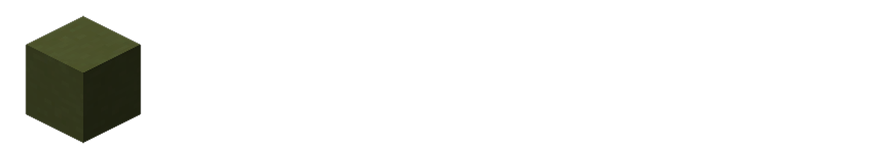
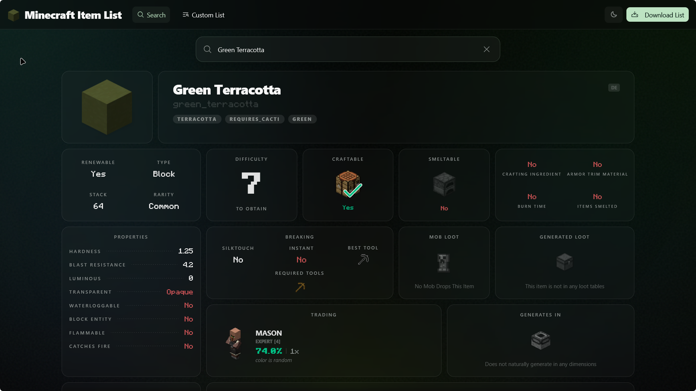

[](https://GitHub.com/L3-N0X/minecraft-item-list/graphs/commit-activity)
[](https://github.com/L3-N0X/minecraft-item-list/issues)
[](https://github.com/L3-N0X/minecraft-item-list/tags)
[](https://github.com/L3-N0X/minecraft-item-list/blob/master/LICENSE)

Visit the live site: [https://l3-n0x.github.io/minecraft-item-list/](https://l3-n0x.github.io/minecraft-item-list/)
<div align="center">
    <a href="https://l3-n0x.github.io/minecraft-item-list/">
        
    </a>
</div>

---

**Minecraft Item List** is a powerful, data-rich web application hosted on GitHub Pages designed for quickly finding, filtering, and exploring every detail of Minecraft items. 

Built with a focus on precision and utility, this project leverages a hand-written, deeply structured JSON database to provide insights that are often difficult to aggregate from standard sources. Whether you are a plugin developer, a technical player, or just curious about item mechanics, this tool offers a comprehensive overview of the Minecraft ecosystem.

## 🚀 Key Features

- **Advanced Filtering & Custom Lists:** Create tailored lists by filtering for specific attributes like chest loot, biome-specific generation, smelting properties, and much more.
- **Developer-First Data:** The underlying JSON structure is designed for easy consumption, making it an ideal reference for plugin developers, modders, and tool creators.
- **Wiki-Grade Accuracy:** Includes detailed percentages for loot tables, structure generation, and many more technical details sourced and verified from the Minecraft Wiki.
- **Quick Search:** Instant access to any item with a UI that exposes every field in the database, including blast resistance, renewability, and stack sizes.
- **Frequent Updates:** The list is updated for new Minecraft releases, ensuring the data stays relevant as the game evolves.

## 📊 Comprehensive Item Data

Every item in the list contains a wealth of information defined by our rigorous `ItemData` schema. Details available include:

*   **General Info:** Display names (English & German), stack sizes, rarity tiers, and renewability status.
*   **Block Properties:** Blast resistance, hardness, luminous levels, transparency, waterloggable status, and whether it’s a block entity.
*   **Combat & Gear:** Attack damage, attack speed, armor points, toughness, knockback resistance, durability, and enchantability.
*   **Survival Mechanics:** Hunger/saturation values, fuel burn times, compostable chances, and silk touch requirements.
*   **Obtaining:** 
    *   **Natural Generation:** Specific biomes, dimensions, and structures.
    *   **Loot Tables:** Exact chances and quantities for chests, mob drops, and block drops.
    *   **Trading:** Villager professions, levels, and probability for trades.
    *   **Special Methods:** Fishing categories, piglin bartering, and smelting recipes (including XP rewards).
*  **And much more!**

## 🏆 Difficulty to Obtain Score

A unique feature of this list is the **Difficulty to Obtain** field. This is a hand-calculated personal score from **1 to 10** representing how hard it is to acquire an item starting from a fresh, untouched world:
- **1:** Very easy (e.g., Dirt, Cobblestone).
- **10:** Extremely difficult/End-game (e.g., Beacon, Netherite Upgrade Template).

## ✍️ Contribution & Web Editor

Maintaining a large JSON database manually is error-prone. To solve this, the project includes a **built-in Web Editor with live JSON Schema validation** (found in `src/schema/schema.json`).

The site builds itself from this schema file! This architecture means:
- **Dynamic Frontend:** When new options or properties are added to the JSON schema, they are immediately available and configurable in the local frontend UI.
- **Easy Editing:** Contributors don't need to manually edit the large JSON files; they can use the web editor to specify all details for any item with live validation.
- **Schema-Driven Validation:** This approach ensures that every contribution adheres to the project's data standards, making it simple to scale and add new properties to every item.

## 🛠️ Local Development

This project is built using **Bun**, **React**, **Tailwind CSS**, and **Shadcn/UI**.

### Prerequisites
- [Bun](https://bun.sh) installed on your system.

### Setup
To install dependencies:
```bash
bun install
```

To start a development server:
```bash
bun dev
```

To build for production:
```bash
bun build
```

### Generate dominant texture colors

To populate `mostDominantColor` for every item in `public/data/items.json` using CIELAB conversion and K-Means clustering:

```bash
python scripts/generate_item_dominant_colors.py
```

---
*Created with ❤️ for the Minecraft Community.*
